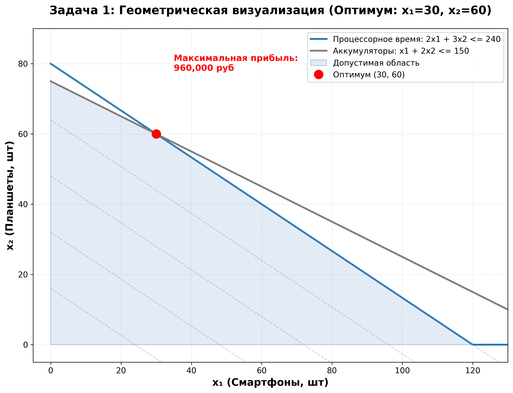
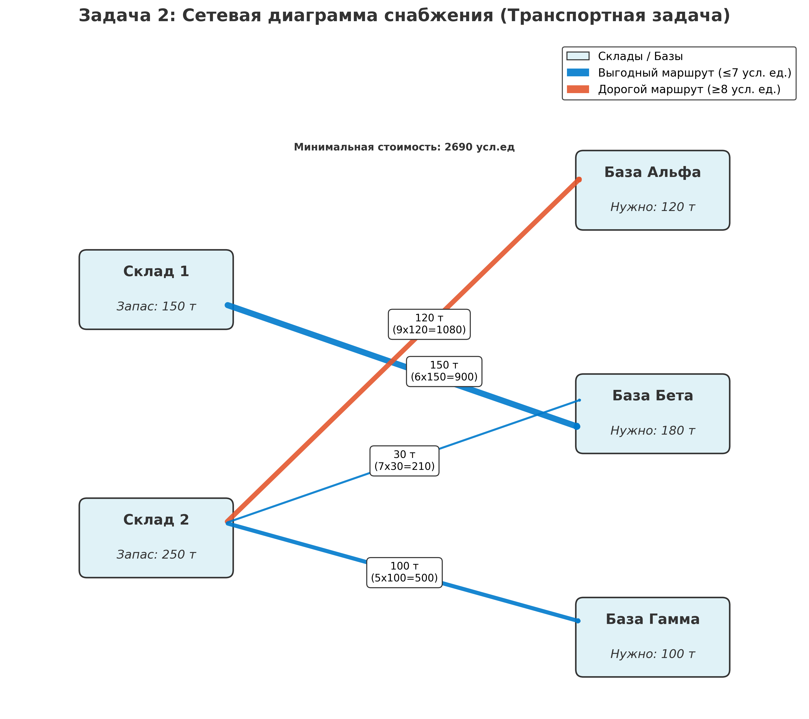

## Лабораторная работа - Линейное Программирование в Задачах Оптимизации

### Цель работы

Освоить практические навыки формализации и решения задач линейного программирования с использованием
Python. Научиться строить математические модели для реальных задач оптимизации в бизнесе и военном деле,
применять методы решения и интерпретировать полученные результаты.

---

## Теоретическая справка

### Основные понятия

**Линейное Программирование (ЛП)** — это математический метод для оптимизации (максимизации или минимизации) **линейной целевой функции**, при условии, что переменные удовлетворяют **системе линейных равенств или неравенств (ограничений)**.

### Общая постановка задачи ЛП

1.  **Целевая функция:** $F(\mathbf{x}) = \sum_{j=1}^{n} c_j x_j \rightarrow \max(\min)$
2.  **Система ограничений:** $A\mathbf{x} \le (\ge, =) \mathbf{b}$
3.  **Условия неотрицательности:** $x_j \ge 0$

### Функция Лагранжа и условия ККТ

**Функция Лагранжа** используется для нахождения экстремума функции при наличии ограничений. Для задачи минимизации с ограничениями-неравенствами $g_i(\mathbf{x}) \le 0$:
$$L(\mathbf{x}, \mathbf{\mu}) = f(\mathbf{x}) + \sum_{i=1}^{m} \mu_i g_i(\mathbf{x})$$

**Условия Каруша-Куна-Таккера (ККТ)** — необходимые условия оптимальности в нелинейном программировании, которые применимы и к ЛП:
1.  **Стационарность:** $\nabla_x L(\mathbf{x}^*, \mathbf{\mu}^*) = 0$
2.  **Допустимость (прямая):** $\mathbf{x}^*$ удовлетворяет всем исходным ограничениям.
3.  **Допустимость (двойственная):** $\mu_i^* \ge 0$ (для ограничений-неравенств).
4.  **Дополняющая нежёсткость:** $\mu_i^* \cdot g_i(\mathbf{x}^*) = 0$. Если ограничение неактивно ($g_i < 0$), его теневая цена $\mu_i$ равна нулю.

### Методы решения

* **Симплекс-метод:** Классический метод, последовательно перебирающий вершины многогранника допустимых решений.
* **Методы внутренней точки (Highs, Interior-Point):** Современные алгоритмы, которые движутся через внутренность допустимой области и часто более эффективны для крупномасштабных задач (используется в `scipy.optimize.linprog`).

---

Предоставленный код использует библиотеку `scipy.optimize.linprog` для решения двух задач линейного программирования: задачи максимизации прибыли и транспортной задачи (минимизация стоимости).

### Общие принципы работы `linprog`

Функция `scipy.optimize.linprog` решает задачу в стандартной форме **минимизации**:

$$\min_{\mathbf{x}} \mathbf{c}^T \mathbf{x}$$
$$\text{при ограничениях: } A_{\text{ub}} \mathbf{x} \le \mathbf{b}_{\text{ub}}$$
$$A_{\text{eq}} \mathbf{x} = \mathbf{b}_{\text{eq}}$$
$$\mathbf{l} \le \mathbf{x} \le \mathbf{u}$$

* **Для максимизации** (как в Задаче 1) целевая функция $\mathbf{c}$ умножается на **-1**.
* **Ограничения-неравенства** передаются через $A_{\text{ub}}$ и $b_{\text{ub}}$.
* **Ограничения-равенства** передаются через $A_{\text{eq}}$ и $b_{\text{eq}}$.
---

## Решение Задачи 1: Оптимизация производства электроники

### Математическая модель

| Ресурс | Смартфон ($x_1$) | Планшет ($x_2$) | Запас |
| :--- | :--- | :--- | :--- |
| **Прибыль** | 8000 | 12000 | — |
| Процессорное время | 2 | 3 | $\le 240$ |
| Аккумуляторы | 1 | 2 | $\le 150$ |
| Оперативная память | 4 | 6 | $\le 480$ |

a) **Переменные решения:**
* $x_1$ — количество **смартфонов** (шт.).
* $x_2$ — количество **планшетов** (шт.).

b) **Целевая функция:**
$$P(x_1, x_2) = 8000x_1 + 12000x_2 \rightarrow \max$$

c) **Ограничения:**
* Процессорное время: $2x_1 + 3x_2 \le 240$
* Оперативная память: $4x_1 + 6x_2 \le 480$ (Избыточное, эквивалентно CPU)
* Аккумуляторы: $x_1 + 2x_2 \le 150$
* Неотрицательность: $x_1 \ge 0, x_2 \ge 0$

---

### Построение функции Лагранжа

a) **Каноническая форма (Минимизация с $g_i(\mathbf{x}) \le 0$):**
* Целевая функция: $f(x_1, x_2) = -8000x_1 - 12000x_2 \rightarrow \min$
* $g_1(x): 2x_1 + 3x_2 - 240 \le 0$ (CPU)
* $g_2(x): x_1 + 2x_2 - 150 \le 0$ (Аккумуляторы)
* $g_3(x): -x_1 \le 0$
* $g_4(x): -x_2 \le 0$

b) **Функция Лагранжа $L(x, \mu)$ (с учётом только двух независимых ограничений ресурсов):**
$$L = (-8000x_1 - 12000x_2) + \mu_1(2x_1 + 3x_2 - 240) + \mu_2(x_1 + 2x_2 - 150) + \mu_3(-x_1) + \mu_4(-x_2)$$

c) **Экономический смысл $\mu_i$ (Теневые цены):**
Множитель $-\mu_i$ показывает, на сколько **увеличится максимальная прибыль** при увеличении запаса $i$-го ресурса на одну единицу.
* $\mu_1$: Теневая цена **процессорного времени** (руб./час).
* $\mu_2$: Теневая цена **аккумуляторов** (руб./шт.).

---

### Код на Python и Результаты

Код, использованный для решения, находится в функциях `solve_task1` и `visualize_task1`.

Задача 1 — **максимизация прибыли** $P = 8000x_1 + 12000x_2$.

1.  **Целевая функция (`c`):**
    ```python
    c = [-8000, -12000] # Умножение на -1 для перехода к минимизации
    ```
2.  **Ограничения-неравенства (`A_ub`, `b_ub`):**
    Соответствуют ограничениям $A_{\text{ub}}\mathbf{x} \le \mathbf{b}_{\text{ub}}$.
    ```python
    A_ub = [
        [2, 3],  # 2*x1 + 3*x2 <= 240 (Процессорное время)
        [1, 2]   # 1*x1 + 2*x2 <= 150 (Аккумуляторы)
    ]
    b_ub = [240, 150]
    ```
    *Ограничение по RAM $(4x_1 + 6x_2 \le 480)$ исключено, так как является избыточным.*
3.  **Решение:**
    ```python
    result = linprog(c, A_ub=A_ub, b_ub=b_ub, bounds=bounds, method='highs')
    ```
    Функция возвращает объект `result`, содержащий оптимальные значения $\mathbf{x}$ (`result.x`) и минимальное значение минимизируемой функции (`result.fun`).
4.  **Финальный расчёт:** Максимальная прибыль вычисляется как `-result.fun`.

**Результаты расчёта:**
```
================================================================================
Задача 1: Оптимизация производства электроники
================================================================================

Исходные данные:
  Смартфоны:  прибыль 8000 руб, требует 2ч CPU, 4ГБ RAM, 1 аккумулятор
  Планшеты:   прибыль 12000 руб, требует 3ч CPU, 6ГБ RAM, 2 аккумулятора
  Ресурсы:    240ч CPU, 480ГБ RAM, 150 аккумуляторов

Математическая модель:
  Переменные: x1 - смартфоны, x2 - планшеты
  Целевая функция: P = 8000*x1 + 12000*x2 -> max
  Ограничения:
    2*x1 + 3*x2 <= 240  (процессорное время)
    x1 + 2*x2 <= 150    (аккумуляторы)
    x1, x2 >= 0

Решение найдено:
  x1 (смартфоны)  = 30.00 шт
  x2 (планшеты)   = 60.00 шт
  Максимальная прибыль: 960,000.00 руб

Использование ресурсов:
  Процессорное время: 240.00 / 240 ч  (полностью)
  Аккумуляторы:       150.00 / 150 шт (полностью)

Анализ:
  Производить 30 смартфонов и 60 планшетов
  Дефицитные ресурсы: процессорное время, аккумуляторы
```


* **Оптимальный план:**
    * $x_1$ (Смартфоны) = **30.00 шт.**
    * $x_2$ (Планшеты) = **60.00 шт.**
* **Максимальная прибыль:** **960 000.00 руб.**

---

### Геометрическая визуализация



---

### Анализ результатов

a) **Интерпретация решения:**
Для достижения максимальной прибыли в **960 000 руб.** компания должна производить **30 смартфонов** и **60 планшетов** в месяц.

b) **Анализ использования ресурсов:**
* **Процессорное время:** Использовано 240 из 240 ч. **(Активное ограничение)**.
* **Аккумуляторы:** Использовано 150 из 150 шт. **(Активное ограничение)**.
* **Оперативная память (RAM):** Использовано $4(30) + 6(60) = 480$ из 480 ГБ. Также активное, но **избыточное** (совпадает с CPU).

Согласно условиям ККТ, для активных ограничений $\mu_i \ne 0$. Поскольку оптимальная точка найдена на пересечении ограничений по CPU и Аккумулярам, эти два ресурса являются **дефицитными** (теневая цена $\mu > 0$). Ограничение по RAM не влияет на оптимум, его теневая цена равна 0, даже несмотря на полное использование.

c) **Чувствительность решения:**
* **Дефицитные ресурсы:** **Процессорное время** и **Аккумуляторы**.
* **Увеличение запаса CPU на 10 часов:** Поскольку теневая цена (из расчёта двойственной задачи, $\mu_i \approx 4000$ руб.) ненулевая, прибыль увеличится примерно на $10 \times 4000 = **40 000 руб.**$

---

## Задача 2: Оптимизация снабжения военных баз (Военное дело)

### Математическая модель

a) **Переменные решения:** $x_{ij}$ — количество тонн МТО со **Склада $i$** на **Базу $j$**.
* $\mathbf{x} = (x_{11}, x_{12}, x_{13}, x_{21}, x_{22}, x_{23})^T$

b) **Целевая функция (Минимизация стоимости $Z$):**
$$Z(\mathbf{x}) = 8x_{11} + 6x_{12} + 10x_{13} + 9x_{21} + 7x_{22} + 5x_{23} \rightarrow \min$$

c) **Ограничения (Равенства):**
* **Склад 1:** $x_{11} + x_{12} + x_{13} = 150$
* **Склад 2:** $x_{21} + x_{22} + x_{23} = 250$
* **База Альфа:** $x_{11} + x_{21} = 120$
* **База Бета:** $x_{12} + x_{22} = 180$
* **База Гамма:** $x_{13} + x_{23} = 100$
* **Неотрицательность:** $x_{ij} \ge 0$

---

### Проверка сбалансированности задачи

a) **Общий запас:** $150 + 250 = **400$ тонн.**
b) **Общая потребность:** $120 + 180 + 100 = **400$ тонн.**

**Вывод:** Задача **сбалансирована** (закрыта), так как Общий запас равен Общей потребности.

---

### Функция Лагранжа

Для сбалансированной транспортной задачи с ограничениями-равенствами функция Лагранжа использует множители $\lambda_i$ (для складов) и $\nu_j$ (для баз):

$$L = Z(\mathbf{x}) + \lambda_1(x_{11}+x_{12}+x_{13}-150) + \lambda_2(x_{21}+x_{22}+x_{23}-250) + \nu_1(x_{11}+x_{21}-120) + \nu_2(x_{12}+x_{22}-180) + \nu_3(x_{13}+x_{23}-100)$$

**Экономический смысл множителей Лагранжа ($\lambda_i, \nu_j$):**
* $\lambda_i$ (Потенциалы складов): Оценивают, как изменится минимальная стоимость при изменении запаса на Складе $i$ на единицу.
* $\nu_j$ (Потенциалы баз): Оценивают, как изменится минимальная стоимость при изменении потребности Базы $j$ на единицу.

---

### Код на Python и Результаты

Код, использованный для решения, находится в функциях `solve_task2` и `visualize_task2`.

Задача 2 — **минимизация стоимости** $Z = 8x_{11} + 6x_{12} + \dots + 5x_{23}$.

1.  **Целевая функция (`c`):**
    ```python
    c = [8, 6, 10, 9, 7, 5] # Коэффициенты стоимости (минимизация по умолчанию)
    ```
2.  **Ограничения-равенства (`A_eq`, `b_eq`):**
    Соответствуют ограничениям $A_{\text{eq}}\mathbf{x} = \mathbf{b}_{\text{eq}}$ (ограничения по запасу складов и по спросу баз).
    ```python
    A_eq = [
        [1, 1, 1, 0, 0, 0],  # Склад 1 (x11 + x12 + x13 = 150)
        # ... и т.д.
        [0, 0, 1, 0, 0, 1]   # База Гамма (x13 + x23 = 100)
    ]
    b_eq = [150, 250, 120, 180, 100]
    ```
3.  **Решение:**
    ```python
    result = linprog(c, A_eq=A_eq, b_eq=b_eq, bounds=bounds, method='highs')
    ```
    Поскольку это задача минимизации, минимальная стоимость напрямую равна `result.fun`.

---

**Результаты расчёта:**
```
Исходные данные:

Склады:
  Склад 1: 150 тонн
  Склад 2: 250 тонн
  Всего:   400 тонн

Базы:
  База Альфа: 120 тонн
  База Бета:  180 тонн
  База Гамма: 100 тонн
  Всего:      400 тонн

Стоимость перевозки (усл.ед/тонна):
              Альфа  Бета  Гамма
  Склад 1:      8     6     10
  Склад 2:      9     7      5

Баланс: 400 = 400 -> задача сбалансирована

Математическая модель:
  Переменные: x_ij - тонн со склада i на базу j
  Целевая функция: Z = 8*x11 + 6*x12 + 10*x13 + 9*x21 + 7*x22 + 5*x23 -> min
  Ограничения по складам:
    x11 + x12 + x13 = 150
    x21 + x22 + x23 = 250
  Ограничения по базам:
    x11 + x21 = 120
    x12 + x22 = 180
    x13 + x23 = 100

Решение найдено:

Оптимальный план перевозок:
  Со Склада 1:
    -> Альфа:   0.00 т  (стоимость:     0.00)
    -> Бета:  150.00 т  (стоимость:   900.00)
    -> Гамма:   0.00 т  (стоимость:     0.00)
  Со Склада 2:
    -> Альфа: 120.00 т  (стоимость:  1080.00)
    -> Бета:   30.00 т  (стоимость:   210.00)
    -> Гамма: 100.00 т  (стоимость:   500.00)

  Минимальная стоимость: 2690.00 усл.ед

Проверка ограничений:
  Склад 1: 150.00 = 150
  Склад 2: 250.00 = 250
  Альфа:   120.00 = 120
  Бета:    180.00 = 180
  Гамма:   100.00 = 100

Используемые маршруты:
  Склад 1 -> Бета     : 150.00 т x  6 =   900.00 усл.ед
  Склад 2 -> Альфа    : 120.00 т x  9 =  1080.00 усл.ед
  Склад 2 -> Бета     :  30.00 т x  7 =   210.00 усл.ед
  Склад 2 -> Гамма    : 100.00 т x  5 =   500.00 усл.ед

Неиспользуемые маршруты:
  Склад 1 -> Альфа    :   0.00 т (стоимость 8 - невыгодно)
  Склад 1 -> Гамма    :   0.00 т (стоимость 10 - невыгодно)
```

**Оптимальный план перевозок:**

| Маршрут | Переменная | Объем (т) | Стоимость (усл.ед.) |
| :--- | :--- | :--- | :--- |
| Склад 1 $\rightarrow$ Бета | $x_{12}$ | **150** | 900.00 |
| Склад 2 $\rightarrow$ Альфа | $x_{21}$ | **120** | 1080.00 |
| Склад 2 $\rightarrow$ Бета | $x_{22}$ | **30** | 210.00 |
| Склад 2 $\rightarrow$ Гамма | $x_{23}$ | **100** | 500.00 |
| Склад 1 $\rightarrow$ Альфа | $x_{11}$ | 0.00 | 0.00 |
| Склад 1 $\rightarrow$ Гамма | $x_{13}$ | 0.00 | 0.00 |
| **Минимальная общая стоимость** | $Z_{min}$ | — | **2690.00 усл.ед.** |

---

### Визуализация сетевой диаграммы



---

### Анализ результатов

a) **Интерпретация решения:**
* **Минимальная стоимость:** **2690 усл. ед.**
* **Используемые маршруты:** Все четыре ненулевых маршрута (из таблицы выше) имеют относительно низкую стоимость.
* **Неиспользуемые маршруты:** **Склад 1 $\rightarrow$ Альфа (8)** и **Склад 1 $\rightarrow$ Гамма (10)**. Они не используются, потому что существуют более выгодные альтернативы со Склада 2 (например, 7 и 5 соответственно).

b) **Военно-логистический анализ:**
* **Потребности баз:** Удовлетворены полностью (120, 180, 100 тонн).
* **Разгрузка складов:** Склады разгружены полностью (150 и 250 тонн).
* **Основной поставщик:** Склад 2 является более универсальным, снабжая Альфу, Бету и Гамму. Склад 1 полностью направляет свой запас на Базу Бета, используя самый выгодный для него маршрут (стоимость 6).

c) **Анализ устойчивости:**
* **Увеличение стоимости $c_{23}$ (Склад 2 $\rightarrow$ Гамма) до 8 усл. ед.:** Изначально $c_{23} = 5$. Увеличение на 3 усл. ед. приведёт к росту общей стоимости на $3 \times 100$ т $= **300$ усл. ед.** (новая $Z = 2990$). Оптимальный план перевозок не изменится, пока не станет выгоднее использовать маршрут Склад 1 $\rightarrow$ Гамма (стоимость 10).
* **Увеличение потребности Базы Альфа на 20 тонн:** Общая потребность превысит запас ($420 > 400$). Задача станет **несбалансированной**. 20 тонн МТО не будут доставлены. Потребуется изменение модели (введение фиктивного поставщика или использование ограничений-неравенств $\le$), и потребности всех баз не смогут быть полностью удовлетворены.

---

## Выводы

В ходе лабораторной работы были успешно освоены практические навыки формализации и решения задач линейного программирования с использованием Python и библиотеки `scipy.optimize`.

1.  **Задача 1 (Бизнес):** Решена задача максимизации прибыли в производстве. Определён оптимальный план, при котором два ресурса (CPU и аккумуляторы) являются **дефицитными** (теневая цена $> 0$), что указывает на узкие места в производстве. Геометрическая визуализация подтвердила, что оптимум находится на пересечении активных ограничений.
2.  **Задача 2 (Военное дело):** Решена сбалансированная **транспортная задача** минимизации логистических расходов. Найден оптимальный план, который минимизирует общую стоимость транспортировки, отдавая предпочтение маршрутам с наименьшей стоимостью. Сетевая диаграмма наглядно показала потоки МТО и их влияние на общую стоимость.

Методы ЛП являются мощным инструментом для принятия оптимальных решений как в бизнесе, так и в логистике (военное дело), позволяя не только найти наилучший план, но и провести анализ чувствительности (теневые цены).

---

## 5. Контрольные вопросы

1.  **В чём отличие задачи максимизации от задачи минимизации при использовании функции `linprog`?**
    * Функция `linprog` по умолчанию решает задачу **минимизации**. Для решения задачи **максимизации** необходимо умножить коэффициенты целевой функции (вектор $c$) на **-1**.

2.  **Что такое множители Лагранжа и какой экономический смысл они имеют?**
    * **Множители Лагранжа** ($\mu_i$ или $\lambda_i, \nu_j$) — это параметры, используемые в функции Лагранжа.
    * **Экономический смысл:** Для задач ЛП они называются **теневыми ценами** (или двойственными переменными). Теневая цена активного ограничения показывает, на сколько изменится оптимальное значение целевой функции при увеличении правой части этого ограничения на единицу.

3.  **Какие условия должны выполняться в точке оптимума согласно условиям ККТ?**
    * Стационарность, Прямая допустимость, Двойственная допустимость ($\mu_i \ge 0$), и **Дополняющая нежёсткость** ($\mu_i \cdot g_i(\mathbf{x}) = 0$).

4.  **Что такое активное ограничение и как его определить из решения?**
    * **Активное ограничение** — это ограничение, которое выполняется как **строгое равенство** в точке оптимума. Оно сдерживает дальнейшее улучшение целевой функции.
    * **Определение:** Для ограничения $\le$, остаток (slack) равен нулю.

5.  **В чём разница между симплекс-методом и методами внутренней точки?**
    * **Симплекс-метод** ищет оптимум, двигаясь вдоль **рёбер** многогранника допустимой области от одной **вершины** к другой.
    * **Методы внутренней точки** ищут оптимум, двигаясь через **внутренность** допустимой области. Они часто более эффективны для очень больших задач.

6.  **Как проверить, является ли транспортная задача сбалансированной?**
    * Задача сбалансирована (закрыта), если **Общий запас** на всех складах равен **Общей потребности** всех пунктов назначения: $\sum \text{Запас}_i = \sum \text{Потребность}_j$.

7.  **Что делать, если транспортная задача несбалансированная?**
    * Её необходимо искусственно **сбалансировать** (открыть), добавив фиктивный склад или фиктивную базу:
        * **Дефицит запаса (Запас < Потребность):** Добавляется **фиктивный склад** с запасом, равным дефициту. Стоимость перевозки с этого склада на любую базу равна нулю.
        * **Избыток запаса (Запас > Потребность):** Добавляется **фиктивная база** с потребностью, равной избытку. Стоимость перевозки на эту базу с любого склада равна нулю.

---

